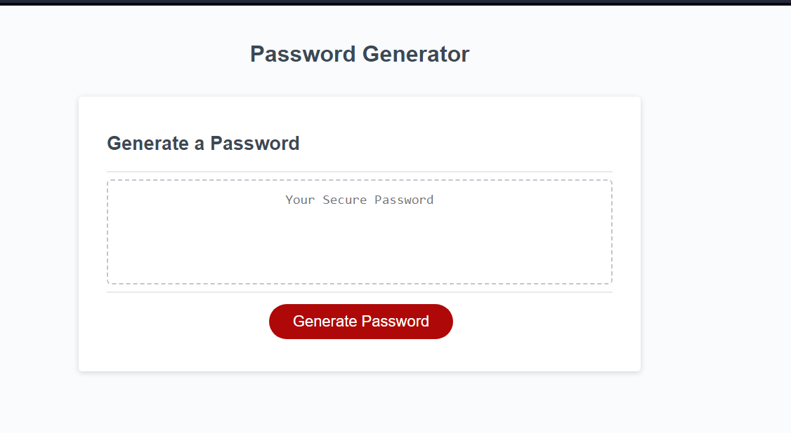

## User Story ##
User wants a password generator that takes into consideration their character types of choice and password length, then randomizes the characters of said types to provide a strong password.

## Information ##
When a user presses the generate password button the user will be prompted with 5 options, one for password length between 8 characters and 128, an option to include uppercase characters, lowercase character, special characters, and number characters. Based on what the user selects to include the password will be generated. 

## How it Works ##

The user selects what to include, the included character types are then funneled into an array and then random characters from that array are then selected to put into the password string. 

## Picture of the site ## 
